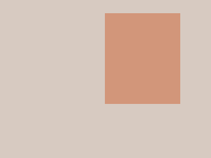

# ImageSegmentation library
Given an image, partition it in 2 parts:
* A monochromatic rectangle
* A monochromatic background

This library contains implementations of the above using various optimisation techniques.

## Interface
The segmentation function signature is as follows:

`Result segment(int ny, int nx, const float* data)`

`struct Result {int y0; int x0; int y1; int x1; float outer[3]; float inner[3]; }`

Where:
* `data` is a colour image with `ny*nx` pixels, each pixel consisting of an R, G, and B component
* size of `data` is `ny*nx*3`
* colour components, are numbered 0 to 2 (R,G,B)
* `x` coordinates are numbered 0 to (nx-1)
* `y` coordinates are numbered 0 to (ny-1)
* a colour component is stored at `data[c + 3*x + 3*nx*y]` where `c` is 0 for R, 1 for G, 2 for B
* The `Result` structure contains the location of the segmentation triangle `(x0, y0, x1, y1)` (upper left and lower right corners), where `0 <= y0 < y1 <= ny` & `0 <= x0 < x1 <= nx`.
* `Result.outer` contains the 3 colour components of the monochromatic background
* `Result.inner` contains the 3 colour components of the monochromatic rectangle

## Applications
The effects of segmentating images, as described above, are depicted in the following examples:

Input image         |  Output image
:------------------:|:--------------------:
  |  
  |  
  |  
  |  
  |  