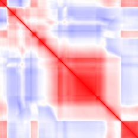
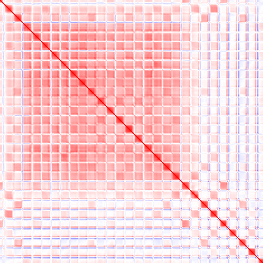
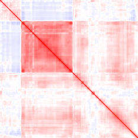
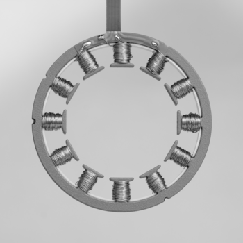
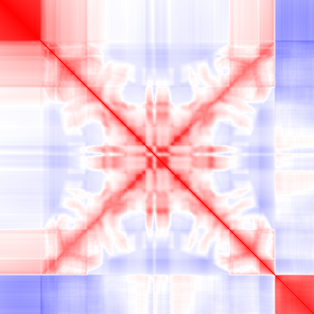
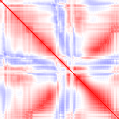

# MatrixCorrelation library
Given a matrix, where each row is a vector of N numbers, the goal is to compute the [correlation](https://en.wikipedia.org/wiki/Pearson_correlation_coefficient) between every pair of rows.

This library contains implementations of the above using varios optimisation techniques.

## Interface
The correlation function signature is as follows:

`void correlate(const int ny, const int nx, const float* const data, float* result)`

Where:
* `data` is a pointer to the input matrix, with `ny` rows and `nx` columns
* For all `0 <= y < ny` and `0 <= x < nx`, the element at row `y` and column `x` is stored in `data[x + y*nx]`
* For all `i` and `j` with `0 <= j <= i < ny`, the correlation coefficient between row `i` of the input matrix and row `j` of the input matrix is calculated and stored at `result[i + j*ny]`

Note:
* Correlations are symmetric, so only the "upper triangle" of the result matrix ought to be computed (i.e the "lower triangle" where `i < j` can be left undefined)

## Applications
The effects of computing row correlation, as described above, could be visualised by applying to a bitmap image, as follows:
* Input image: vector `i` is row `i` of the image
* Output image:
    * If correlation(row i, row j) >= 0 then pixel(i, j) = RED
    * If correlation(row i, row j) < 0 then pixel(i,j) = BLUE

Input image         |  Output image
:------------------:|:--------------------:
  |  
  |  
  |  
  |  
  |  